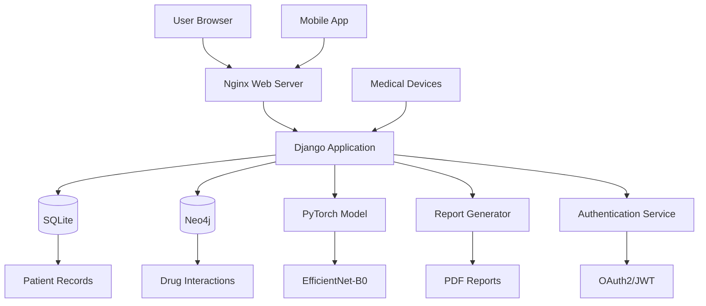

# Intelligent Medical Diagnostics and Treatments of Skin Diseases  

1. [Project Overview](#project-overview)
2. [System Architecture](#system-architecture)
3. [Installation Guide](#installation-guide)    
   2.1 [Prerequisites](#prerequisites)    
   2.2 [Setup Steps](#setup-steps)  
4. [Key Features](#key-features)  
5. [Technical Specifications](#technical-specifications)    
   4.1 [Backend Architecture](#backend-architecture)    
   4.2 [Frontend Implementation](#frontend-implementation)        
   4.3 [API Endpoints](#api-endpoints)
6. [Model Architecture](#model-architecture)
7. [Data Architecture](#data-architecture)    
8. [Usage Instructions](#usage-instructions)  
9. [Support and Maintenance](#support-and-maintenance)  
10. [License](#license)  
11. [Acknowledgments](#acknowledgments)


## Project Overview
MedSkin is an intelligent web application combining AI-powered skin disease detection with comprehensive patient management. The system features:

- 🩺 Deep Learning-based disease classification (5 skin conditions)
- 💊 Smart drug interaction checking using graph databases
- 📊 Automated medical report generation
- 📈 Treatment effectiveness tracking

## System Architecture


## Installation Guide 

### Prerequisites
- Python 3.10+
- SQLite 3
- Neo4j 5.28
- wkhtmltopdf 0.12.6

### Setup Steps
1. Clone repository:
```bash
git clone https://github.com/HazimMT/MedSkin.git
cd MedSkin
```

2. Create virtual environment:
```bash
python -m venv venv
source venv/bin/activate  # Linux/Mac
venv\Scripts\activate  # Windows
```

3. Install dependencies:
```bash
pip install -r requirements.txt
```

4. Configure databases:
```python
# SQLite3 Configuration (settings.py)
DATABASES = {
    'default': {
        'ENGINE': 'django.db.backends.sqlite3',
        'NAME': BASE_DIR / 'db.sqlite3',
    }
}

# Neo4j Configuration (GD.py)
URI = "bolt://localhost:7687"
USERNAME = "neo4j"
PASSWORD = "newpassword"
```

5. Initialize system:
```bash
python manage.py migrate
python manage.py loaddata initial_data.json
```

## Key Features

### Core Modules:
1. **AI Diagnosis Engine**
   - EfficientNet-B0 model (85%+ accuracy)
   - Confidence-based predictions

2. **Patient Management**
   - CRUD operations for patient records
   - Disease history tracking


3. **Smart Pharmacology**
   - Neo4j-powered drug interaction checker
   - 150+ drug compatibility rules
   - Treatment recommendation system

4. **Report Automation**
   - PDF generation with Jinja2 templates
   - Dynamic content insertion
   - Download/View functionality

## Technical Specifications

### Backend Architecture  
| Component               | Technology/Package           | Version     | Implementation Details                          |  
|-------------------------|------------------------------|-------------|-------------------------------------------------|  
| Web Framework           | Django                       | 4.1.4       | `medskin_backend/settings.py` configuration     |  
| Primary Database        | SQLite (Development)         | 3.37+       | `DATABASES` in settings.py                      |  
| Graph Database          | Neo4j                        | 4.4         | `GD.py` driver configuration                    |  
| ML Framework            | PyTorch                      | 1.12.0      | Integrated via `model_method.ipynb`             |  
| PDF Generation          | pdfkit + wkhtmltopdf         | 1.0.0       | `Report.py` template rendering                  |  
| API Security            | django-cors-headers          | 3.13.0      | CORS configuration in settings.py               |  
| Database ORM            | django-neomodel              | 0.0.9       | Neo4j graph operations in `GD.py`               |  
| Template Engine         | Jinja2                       | 3.1.2       | HTML template rendering in `Report.py`          |  
  
### Frontend Implementation  
| Component               | Technology                   | Implementation Files                          | Key Features                                  |  
|-------------------------|------------------------------|-----------------------------------------------|-----------------------------------------------|  
| Core Markup             | HTML5                        | `templates/tool.html`                         | Semantic structure, WAI-ARIA                 |  
| Styling                 | CSS3 + Custom Framework      | `static/css/tool.css`, `navbar.css`           | Responsive design, CSS variables              |  
| Interactivity           | Vanilla JavaScript           | `static/js/tool.js`, `navbar.js`              | DOM manipulation, Fetch API                  |  
| UI Components           | Custom Design System         | `templates/*.html`                            | Reusable components, BEM methodology         |  
| File Handling           | Drag & Drop API              | `tool.html` dropzone                          | File validation, progress tracking           |  
| PDF Handling            | PDF.js (Browser-native)      | `tool.html` report section                    | In-browser preview, download functionality   |

### API Endpoints
| Endpoint | Method | Description |
|----------|--------|-------------|
| `/api/patients/` | GET | List all patients |
| `/api/patients/{id}/` | GET | Get patient details |
| `/api/reports/` | POST | Generate medical report |
| `/api/drugs/` | GET | List available medications |

### API Error Reference 
  
| HTTP Code | Error Type                | Resolution Steps                      |  
|-----------|---------------------------|---------------------------------------|  
| 400       | Invalid Patient ID        | Verify ID format (P-XXXX-XXXX)        |  
| 403       | Cross-Origin Rejected     | Check CORS configuration              |  
| 415       | Invalid Image Format      | Upload JPEG/PNG under 5MB             |  
| 429       | Rate Limit Exceeded       | Wait 60 seconds between requests      |  
| 500       | PDF Generation Failed     | Check wkhtmltopdf installation        |  
| 503       | Database Connection Error | Verify Neo4j service status           |

## Model Architecture

### EfficientNet-B0 Implementation

<div align="center">
  
  <p><em>MBConv Building Blocks Architecture (Source: <a href="https://www.researchgate.net/figure/Architecture-of-EfficientNet-B0-with-MBConv-as-Basic-building-blocks_fig3_356981443">ResearchGate</a>)</em></p>
</div>

<div align="center">
  
  <p><em>Complete Model Architecture (Source: <a href="https://learnopencv.com/efficientnet-theory-code/">LearnOpenCV</a>)</em></p>
</div>

### Key Components
| Component               | Specification              |  
|-------------------------|----------------------------|  
| Base Model              | EfficientNet-B0            |  
| Input Resolution        | 224x224 RGB                |  
| Output Classes          | 5 skin conditions          |  
| Training Dataset        | DermNet                    |  
| Validation Accuracy     | 85.4%                      | 


## DATA ARCHITECTURE  
  
### SQLite Schema (Patient Management): 
```
# patients/models.py
class Patient(models.Model):
    patient_id = models.CharField(max_length=50, unique=True)
    full_name = models.CharField(max_length=100)
    birth_date = models.DateField(null=True, blank=True)
    diseases = models.TextField(blank=True, null=True) 
 ```
 
### Neo4j Graph Structure (Drug Interactions):
```
// Sample Cypher Query (GD.py)
MATCH (d:Drug)-[r:TREATS]->(s:Disease)
WHERE s.name = "Psoriasis"
RETURN d.name, r.efficacy  
```

### Data Flow
User → Django View → PyTorch Model → Neo4j Analysis → PDF Report → User
 


## Usage Instructions

1. **Patient Registration**
   - Navigate to `/patients-page`
   - Enter patient ID and full name
   - Select existing conditions from dropdown

2. **Diagnosis Process**
   - Go to `/tool`
   - Search patient by ID
   - Upload lesion image (JPEG/PNG)
   - Click "Generate Report"

3. **Report Generation**
   - System processes image
   - AI model generates diagnosis
   - PDF report created automatically

## Support and Maintenance

For technical support or bug reports:
- GitHub Issues: https://github.com/HazimMT/medskin/issues

Dependency Updates:
```
pip-audit && pip install -U $(pip-audit --format json | jq -r 
'.vulnerabilities[].fix_versions[]') 
```

## License
This project is currently unlicensed. For usage permissions, please contact the maintainers.

## Acknowledgments
 - Medical Data Sources
   - DermNet for disease imagery
   - DrugBank for pharmacological data
 - Machine Learning
   - PyTorch
   - EfficientNet paper contributors
  - Core Technologies
    - Django Software Foundation
    - Neo4j, Inc.
    - WKHTMLTOPDF developers

---
LAST UPDATED: March 2024  
VERSION: 2.0.0  
MAINTAINER: HazimMT  
CONTACT: GitHub Issues (https://github.com/HazimMT/medskin/issues)

